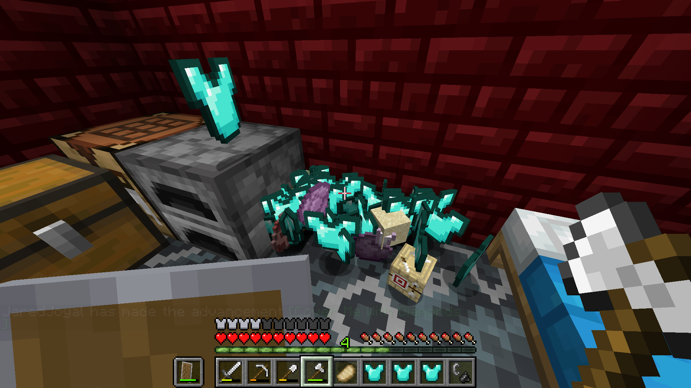
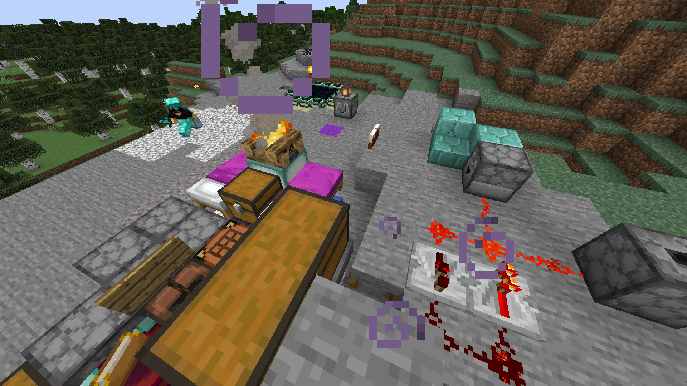

# 
A Minecraft Forge mod focused on randomizing item drops

## Features (per v1.2.1)
* Items randomized on mob drops
* Items randomized on block drops
* Really, items randomized every time a new ItemEntity is spawned
* Items dropped by the player are ignored
* Items dropped on player death are ignored
* Items that previously existed are ignored (e.g. on chunk unload/reload)
* NBT Data added to:
  * Shulker boxes, giving a chance for a box to have an item inside it
  * Potions (drinkable, splash, lingering), giving them one potion effect
  * Tipped arrows, giving them one potion effect
  * Suspicious stew, giving them one effect
  * Written books, giving them a randomly-generated sentence
  * Enchanted books, giving them up to 10 random enchantments

## Download
[Click here to download from CurseForge!](https://www.curseforge.com/minecraft/mc-mods/jrandomizer)

## Screenshots
 
